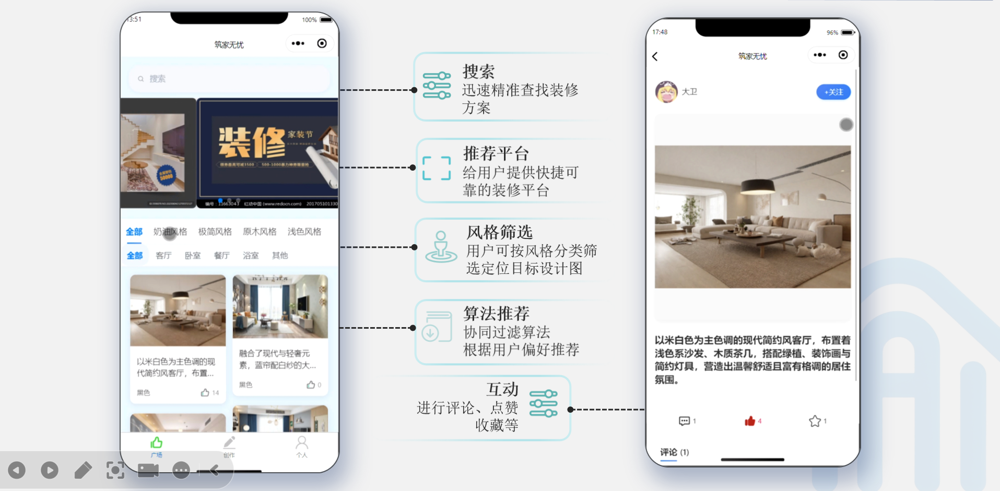
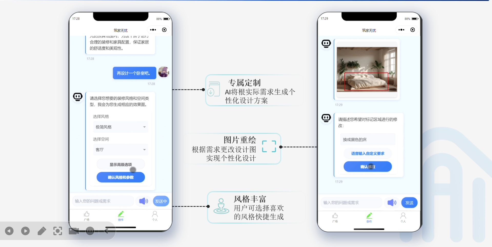
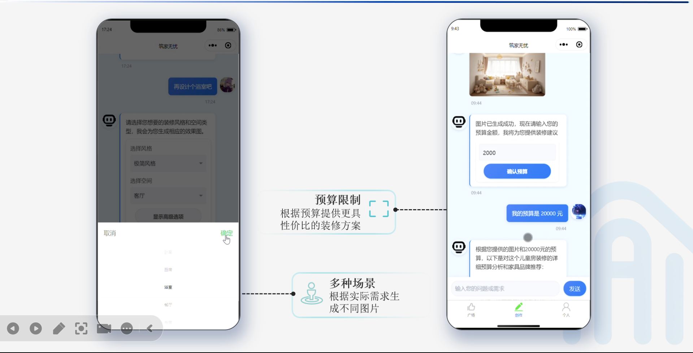
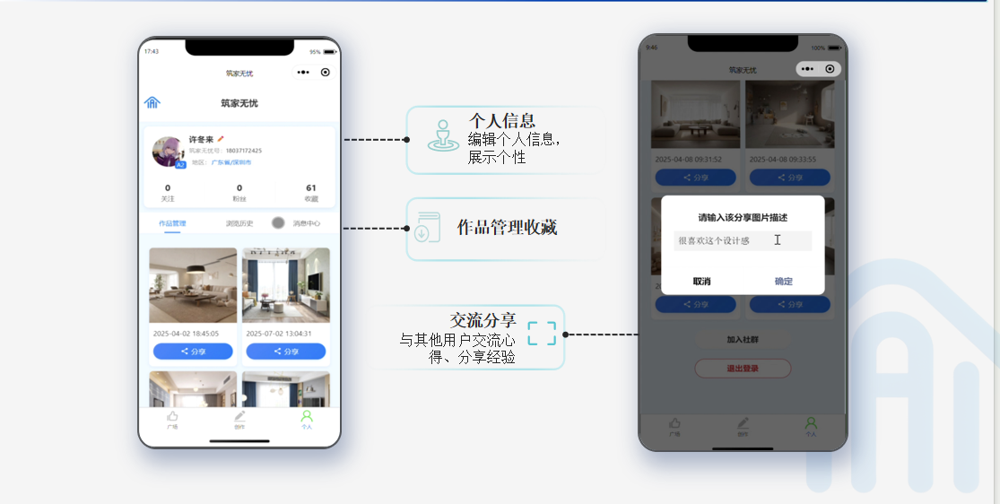
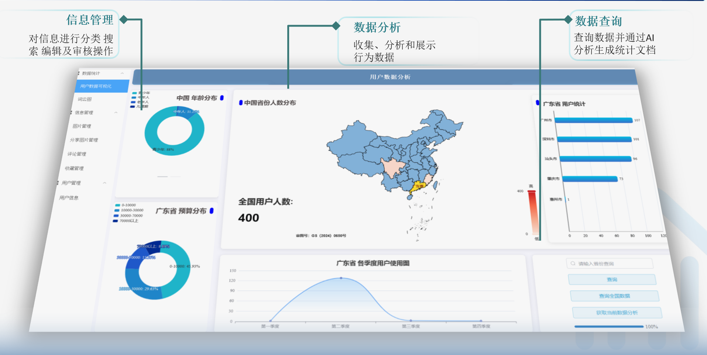
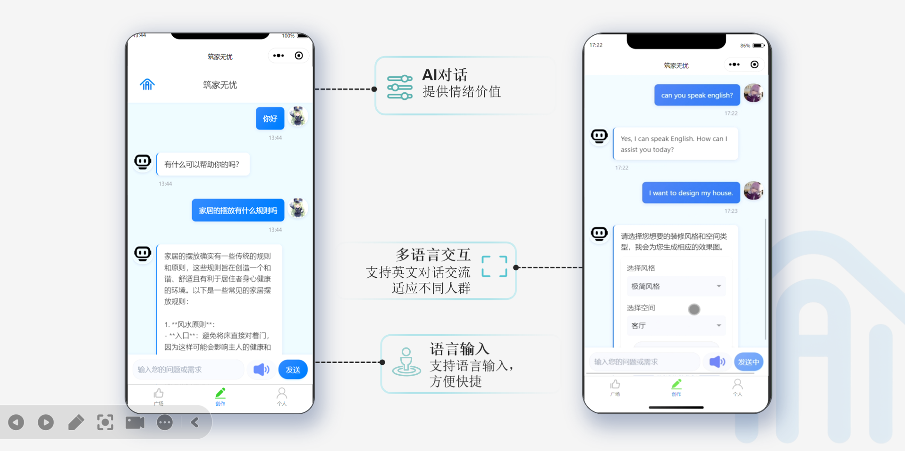

# 筑家无忧 - 装修与空间设计AI应用平台

## 项目简介

**筑家无忧**是一个面向装修与空间设计场景的生成式AI应用平台，通过AI技术为用户提供智能化的室内设计解决方案。平台集成了风格选择、户型图上传、AI效果图生成、局部修改、预算建议、作品推荐与社区互动等完整业务流程，帮助用户轻松实现理想家居设计。

## 核心功能

### 🎨 AI智能设计
- **多风格选择**：提供现代简约、北欧、中式、美式等多种装修风格
- **户型图识别**：支持上传户型图，AI自动识别房间布局和尺寸
- **一键生成效果图**：基于户型图和风格偏好，自动生成高质量3D效果图
- **局部修改**：支持对特定区域进行精细化调整和重新生成

### 💰 智能预算规划
- **材料成本估算**：根据设计方案自动计算所需材料和人工成本
- **预算优化建议**：提供不同价位的替代方案和成本控制建议
- **分项明细**：详细的预算分解，包括硬装、软装、家电等各项费用

### 👥 社区互动
- **作品展示**：用户可以发布自己的设计作品
- **收藏点赞**：支持对喜欢的作品进行收藏和点赞
- **关注系统**：关注优秀设计师和其他用户
- **评论互动**：在作品下方进行交流讨论

### 🎤 语音交互
- **语音输入**：支持通过语音描述设计需求和修改意见
- **智能理解**：AI准确理解用户的语音指令并执行相应操作

## 技术架构

### 前端架构
- **Web管理端**：基于Vue3 + Element Plus构建的后台管理系统
- **Web前台**：基于Vue3构建的用户界面，响应式设计
- **微信小程序**：原生小程序开发，提供移动端最佳体验

### 后端架构
- **核心框架**：Spring Boot 2.x
- **数据库**：MySQL关系型数据库
- **AI服务**：集成生成式AI模型，支持图像生成和处理
- **文件存储**：本地文件系统 + CDN加速
- **接口规范**：RESTful API设计

### 目录结构
```
筑家无忧/
├── assets/                 # 功能展示截图
├── WeChat/                 # 微信小程序源码
│   └── WeChat/
│       ├── pages/          # 小程序页面
│       ├── utils/          # 工具函数
│       └── app.js          # 小程序入口
├── houduan/                # 后端源码
│   ├── springboot/         # Spring Boot后端
│   │   ├── src/main/java/com/example/
│   │   │   ├── controller/ # 控制器层
│   │   │   ├── service/    # 服务层
│   │   │   ├── mapper/     # 数据访问层
│   │   │   └── entity/     # 实体类
│   │   └── resources/      # 配置文件
│   └── vue/                # Vue前端源码
│       ├── src/views/      # 视图组件
│       ├── src/components/ # 公共组件
│       └── src/router/     # 路由配置
└── README.md               # 项目说明文档
```

## 部署指南

### 后端部署 (Spring Boot)

1. **环境准备**
   - JDK 1.8+
   - Maven 3.6+
   - MySQL 5.7+

2. **数据库配置**
   ```yaml
   # application.yml
   spring:
     datasource:
       url: jdbc:mysql://localhost:3306/zhujiawuyou?useUnicode=true&characterEncoding=utf8&serverTimezone=UTC
       username: your_username
       password: your_password
   ```

3. **启动应用**
   ```bash
   cd houduan/springboot
   mvn clean package
   java -jar target/springboot-0.0.1-SNAPSHOT.jar
   ```

### Web前端部署 (Vue)

1. **安装依赖**
   ```bash
   cd houduan/vue
   npm install
   ```

2. **配置API地址**
   ```javascript
   // src/utils/request.js
   const baseURL = 'http://your-server-address:9090';
   ```

3. **构建和部署**
   ```bash
   npm run build
   # 将dist目录部署到Web服务器
   ```

### 微信小程序部署

详细的小程序部署说明请参考 [`WeChat/WeChat/README.md`](WeChat/WeChat/README.md)

## 功能演示

### 首页展示


### AI效果图生成


### 智能预算方案


### 用户个人主页


### 后台管理界面


### 语音输入功能


## 开发团队

本项目由团队开发，致力于通过AI技术革新传统装修设计行业，为用户提供更智能、更便捷的设计体验。

## 联系方式


---

**筑家无忧 - 让每个家庭都能拥有理想的居住空间**